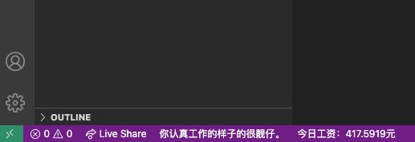

# mySalary

仅供娱乐的vscode小插件，可以再vscode状态栏上显示今日实时赚取的工资。以及工作状态小提示，感觉工作更有动力了呢！

## Features

* 显示你当天到此时所获得的工资  
* 在不同工作时段，显示不同的小提示   

  

**仅供娱乐**


### TODO LIST: 

* 到一定金额弹出金币或者自定义动画提示

### install

```bash
    npm install
```

### run

vscode: press F5 -->Run Extension
